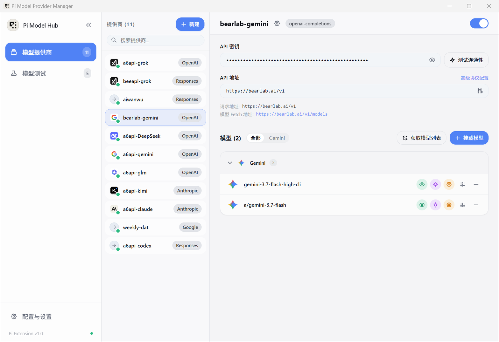

# 快速上手指南

只需几个步骤，就能把你的第一个中转渠道接入 Pi 并在终端里用起来。

---

## 1. 载入扩展插件

确保你已经在当前项目或全局环境里加载了扩展：

```bash
# 临时运行
pi -e ./dist/atrium-pi-modelprovider-manager/index.js

# 或者放入 Pi 的扩展发现目录（推荐，每次启动自动就绪）
# ~/.pi/agent/extensions/atrium-pi-modelprovider-manager/
```

---

## 2. 打开管理窗口

你可以通过终端命令唤出管理界面：

```bash
/model-manager
```

也可以直接双击运行编译产物中的 `atrium-pi-modelprovider-manager.exe`。管理窗口支持单实例运行，即使已经在后台，再次输入命令也会把已有窗口平滑唤至前台。



---

## 3. 添加你的第一个渠道

1. 点击左侧列表上方的 **「+ 新建」**。
2. 填写基础信息：
   - **唯一标识**：给它起个简短好记的名字，例如 `my-deepseek` 或 `a6-claude`。
   - **Base URL**：你的中转站端点地址（例如 `https://api.your-proxy.com/v1`）。
   - **底层协议**：通常选择 `OpenAI Completions (/v1/chat/completions)`，如果是官方 Claude 原生中转，选择 `Anthropic Messages`。
   - **API Key**：支持明文输入，也可以写成 `$DEEPSEEK_API_KEY` 直接引用环境变量。
3. 点击 **「测试连通性」**。看到绿色打勾和延迟数值后，说明鉴权和网络都没问题。

---

## 4. 挂载模型

有了渠道后，把你想用的模型加进来：

- **自动获取**：如果中转站开放了 `/v1/models`，直接点击 **「获取模型列表」**，在弹出的窗口里勾选你要的模型即可一键添加。
- **手动添加**：如果中转站不支持远端枚举，点击 **「+ 挂载模型」**，填入上游规定的准确模型名称（例如 `claude-3-7-sonnet-20250219`），保存即可。

---

## 5. 在终端切换模型并开始对话

所有修改实时保存在本地，无需重启终端。

1. 切回你的 Pi 终端界面。
2. 按下快捷键 **`Alt + P`**（或者输入 `/models`）。
3. 终端会弹出模型选择器，通过上下方向键或输入文字过滤找到你刚才添加的模型，按 `Enter` 确认。
4. 终端状态栏显示切换成功，现在你可以正常向模型提问了。
