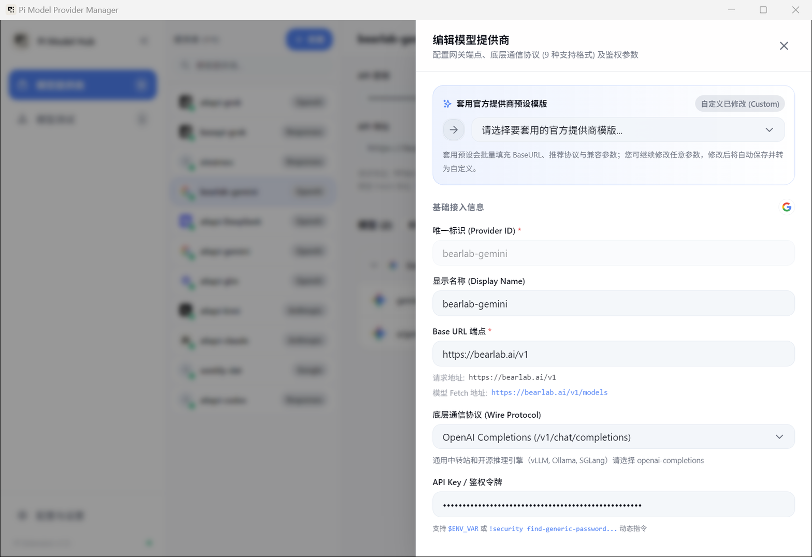

# 模型提供商配置指南

在管理面板中，每个**提供商（Provider）**对应你手中的一个 API 来源。它可能是一个聚合中转站、一家官方 API 账号，或者是你本地跑的 Ollama / vLLM。

---

## 基础配置

点击渠道卡片右侧的齿轮图标或「+ 新建」，即可打开编辑抽屉：

这里有几个核心字段：

- **唯一标识 (ID)**：中转站的系统 ID。建议只使用小写英文字母和中划线（如 `bearlab-gemini`、`a6api-claude`）。
- **显示名称**：在界面展示的备注名字，留空则默认显示 ID。
- **Base URL**：请求的基础地址。请特别留意是否包含 `/v1`。大多数兼容 OpenAI 规范的中转站都需要写成 `https://domain.com/v1`。
- **底层通信协议**：决定向端点发请求时的数据格式。
- **API Key**：你的访问密钥。

---

## 9 种协议什么时候该选哪个？

Pi Agent 支持极其丰富的通讯协议，几乎可以对接市面上所有的模型端点：

| 协议名称 | 适用场景 |
| :--- | :--- |
| **`openai-completions`** | **最常用的选择**。绝大多数通用中转站（NewAPI、OneAPI 等）、开源推理后端（vLLM、SGLang、Ollama OpenAI 兼容模式）都使用此协议，接口路径通常为 `/v1/chat/completions`。 |
| **`openai-chat`** | OpenAI 官方端点及严格遵守 OpenAI 原始规范的直连通道。 |
| **`anthropic-messages`** | Anthropic 官方直连或支持原生 `/v1/messages` 格式的 Claude 中转站。 |
| **`google-generate-content`**| Google AI Studio 直连或支持 Gemini 原生 REST 格式的中转站。 |
| **`responses`** | 面向现代高频流式编码场景的响应格式，拆包更轻量。 |
| **`azure-openai`** | 微软企业级 Azure OpenAI 部署。 |
| **`ollama`** | 本地运行的 Ollama 原生接口（默认 `http://localhost:11434`）。 |
| **`mistral`** | Mistral 官方端点（如 Codestral）。 |
| **`custom-protocol`** | 私有网关或实验性协议。 |

> **不知道选哪个？** 如果是国内买的中转站，90% 以上直接选 `openai-completions` 即可；如果买的是专门的 Claude 原生中转，选 `anthropic-messages`。

---

## API Key 的填写方式

为了安全和跨设备共享，密钥支持三种格式：

1. **直接填明文 Key**：最简单，直接粘贴 `sk-...`。
2. **引用环境变量（推荐）**：填入 `$DEEPSEEK_API_KEY` 或 `$OPENAI_API_KEY`。请求发出时，程序会自动从系统环境变量中取出真实密钥。如果你需要导出配置分享给朋友或推到 Git，这种方式绝不会泄露真实密钥。
3. **动态指令提取**：以感叹号开头，例如 `!pass show api/claude`。发请求前会自动在系统后台执行该命令，将其输出作为临时 Token，适合使用密码管理器的开发者。

---

## 进阶设置与中转站兼容补丁

很多第三方中转站的实现并不完全符合官方最新规范，我们提供了细致的调节开关：

- **自动注入 Bearer Token**：默认开启。会自动在请求头中加上 `Authorization: Bearer <Key>`。某些特殊渠道如果使用自定义 Header（如 `api-key`），可以关闭此项并在下方自定义请求头。
- **提供商专属环境变量 (Scoped ENV)**：例如 Cloudflare 的 `CLOUDFLARE_ACCOUNT_ID` 或 Azure 的 `AZURE_OPENAI_RESOURCE_NAME`。在这里配置后只对当前提供商生效，不影响你的系统环境。
- **自定义请求头 (Headers)**：每次请求自动携带的 HTTP 标头，例如注入特定的 `Trace-Id` 或 `HTTP-Referer`。
- **中转补丁 (Adaptation Patches)**：如果某个中转站在收到 `stream_options` 或 `store` 等较新字段时报 400 错误，直接在补丁选项中勾选「移除不兼容字段」，程序会在发送前自动剔除多余参数。
