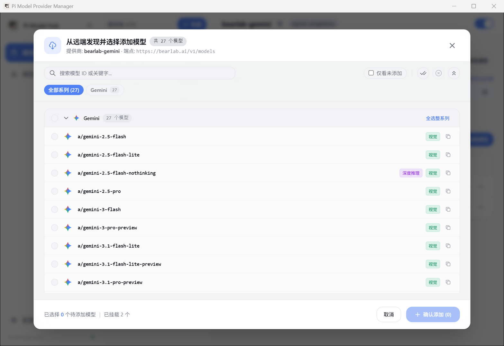
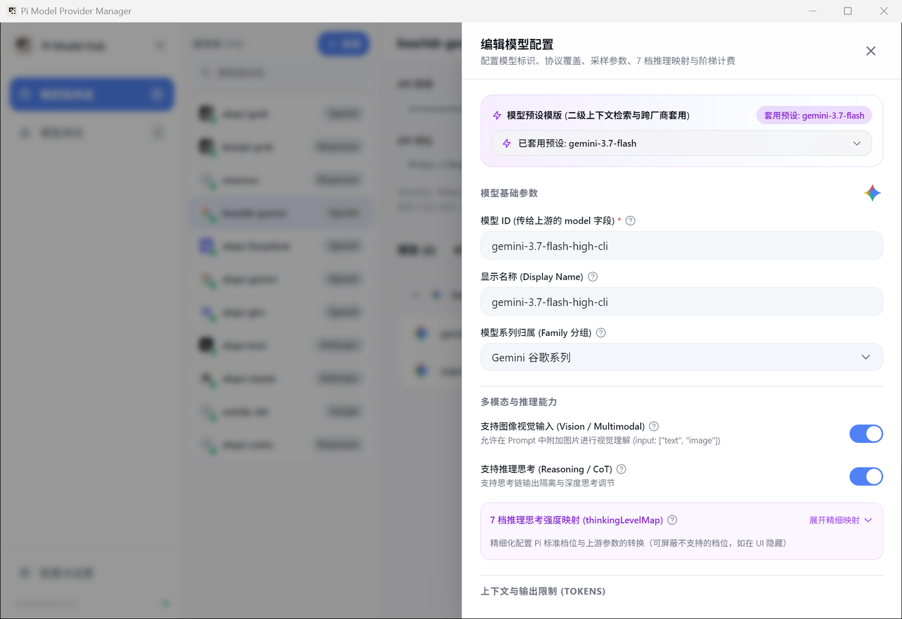

# 模型挂载与参数调优

有了提供商之后，你可以把该渠道支持的具体模型添加进来，并根据实际需要进行精细调优。

---

## 快速添加模型

### 1. 从远端一键发现（推荐）
点击渠道面板右上角的 **「获取模型列表」**：

系统会直接调用端点的 `/models` 接口把全部可用模型拉下来。在弹窗里你可以：
- 看到模型是否支持视觉多模态、是否支持深度思考。
- 按系列（Gemini、Claude、DeepSeek 等）一键全选整组模型。
- 勾选「仅看未添加」，排除掉已经挂载过的项。

### 2. 手动挂载
某些中转站关掉了远端模型列表接口。此时点击 **「+ 挂载模型」**，手动填写模型 ID（必须和上游要求的一模一样，如 `deepseek-chat` 或 `gpt-4o`）即可。

---

## 模型配置详情

点击模型卡片上的齿轮图标，即可进入模型编辑抽屉：

### 1. 基础信息与品牌系列
- **模型 ID (`id`)**：传给上游请求体中的实际 `model` 参数。
- **显示名称 (`name`)**：在终端里展示给自己的名字。
- **模型系列归属 (`family`)**：决定在列表和选择器中展示哪家厂商的 Logo 和分组。

### 2. 多模态与思考控制
- **支持图像视觉输入**：开启后，在 Pi 终端发送图片时会自动编码并注入请求体。
- **支持推理思考 (Reasoning / CoT)**：开启后，模型的思考过程会独立折叠渲染，不与正式代码混杂。

### 3. 7 档思考强度映射（thinkingLevelMap）
不同中转站和模型对“思考深度”的控制方式千差万别：
- Claude 3.7 接受 `thinking.budget_tokens`（按 Token 数量控制，如 1024 ~ 64000）；
- Gemini 2.5 / 3.7 接受 `thinkingBudget`；
- OpenAI o 系列与 DeepSeek 接受 `reasoning_effort`（low / medium / high）。

Pi 终端为用户抽象了一套统一的思考档位（off, minimal, low, medium, high, max）。在这个抽屉里，你可以精确设定每个档位对应向上游发送什么具体数值。

> **小技巧**：如果某个渠道不支持极端档位（例如最高只允许 16k 思考），可以在映射里把不支持的档位关闭。这样在终端里切换思考深度时，就会自动隐藏那些无效选项，避免误选报错。

### 4. 上下文与输出限制
- **上下文窗口 (Context Window)**：例如 `128000` (128K) 或 `1048576` (1M)。Pi 终端会根据这个数值实时计算你的上下文占用百分比，并在快满时自动发出提醒。
- **单次最大输出 (Max Tokens)**：控制单次回答允许生成的最大长度（如 `16384` 或 `65536`），防止长代码写到一半被硬截断。

### 5. 计费费率设置
支持填写该模型在每百万 Token 下的价格（输入、输出、缓存命中读取、缓存写入）。配置后，测试工作台能直接计算每次调用的真实花费。

### 6. 模型级局部覆盖 (Override)
如果你同一个中转站下的大多数模型走标准端点，但只有某一个特定模型需要特殊的 URL、独立的采样温度（temperature）或特殊的参数补丁，可以在抽屉底部的局部覆盖中单独设置，它会自动覆盖提供商的全局配置。
