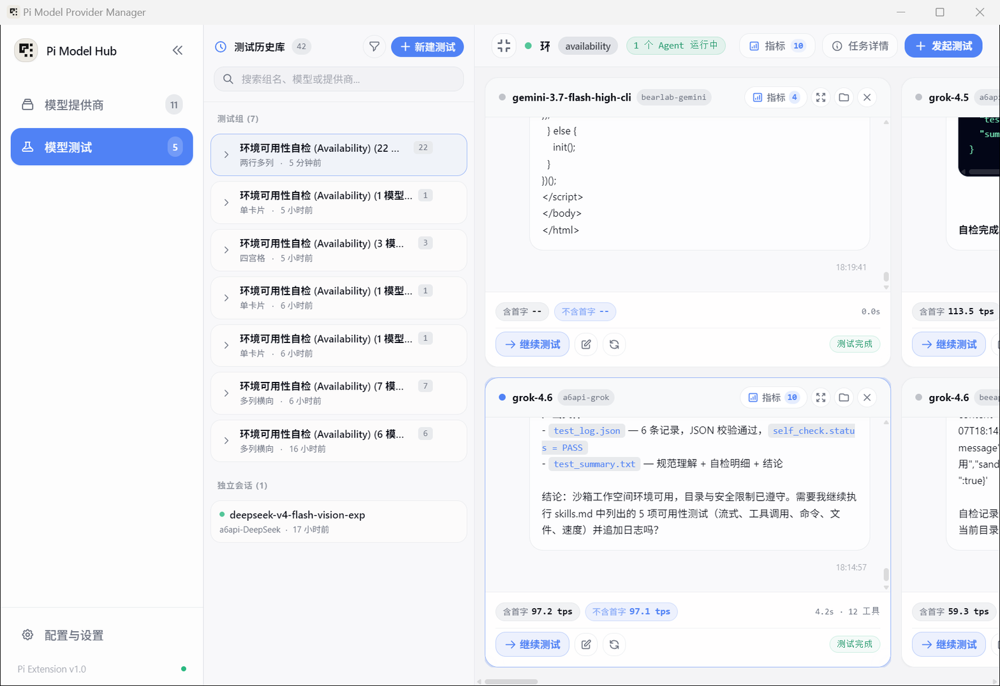
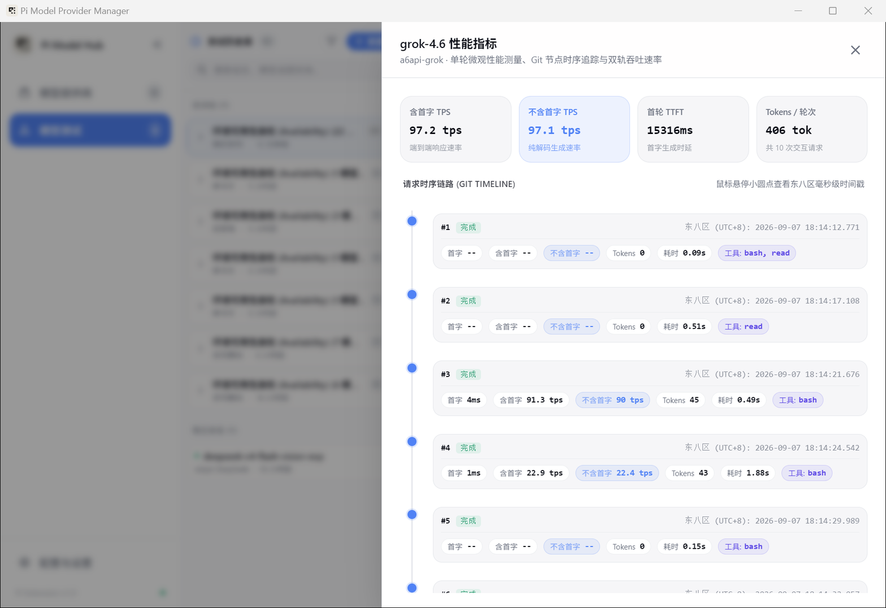

# 模型评测工作台实战

这是整个项目中我们投入最多精力、完全原创的核心系统。

---

## 为什么我们需要这套测试系统？

我们的主要目标用户，是向往**模型自由**的开发者：我们不希望被少数两三家大厂的高昂月租订阅绑死，而是在手上收集了十几个不同的中转渠道，按市场的真实用量和价格灵活使用模型。

但这种自由带来了一个现实痛点：**不同中转渠道的质量良莠不齐**。
- 有的中转站号称是原版 Claude 3.7，实际背后用了廉价模型偷梁换柱；
- 有的渠道首字响应奇慢，卡顿十多秒；
- 有的渠道搞假流式，憋了一大段才一口气喷出来；
- 还有的模型在处理多工具连续调用或长上下文时频繁断流报错。

如果没有一个统一的检验环境，你根本不知道手上的渠道哪个快、哪个真、哪个稳。

为此，我们构建了这个多卡片并行评测工作台：让来自不同渠道、不同厂商的模型在完全相同的测试标准和隔离沙箱下同台竞技，用真实数据说话。

---

## 界面与 5 种分屏布局

点击侧边栏的 **「模型测试」** 即可进入工作台：

- **左侧：测试历史库**：按测试组和独立会话分类，随时回溯历史评测记录，支持按状态和关键字筛选。
- **右侧：多卡片竞技场**：每个卡片运行一个模型会话。点击左上角的布局切换按钮，可以自由切换 **5 种布局模式**：
  1. **单卡片**：聚焦一个模型做深度对话与追踪。
  2. **双列对齐**：并排对比两款主力模型（例如测试 A 站 Claude 3.7 与 B 站 Claude 3.7 是否一致）。
  3. **四宫格**：2x2 结构，适合 4 个模型的小规模盲测。
  4. **多列横向流式**：高密度展示多个模型的输出对比。
  5. **两行多列矩阵**：适合 6~20 个模型的大规模渠道批量巡检。

---

## 5 个内置专业测试任务

我们预设了 5 个覆盖不同维度的基准测试任务，帮你全方位摸清渠道底细：

1. **`01_site_availability`（环境可用性自检）**  
   检验基础连通性与指令遵循。模型需要在沙箱中读取说明文件、检查工具环境，并将结构化结果写入 `test_log.json`。
2. **`02_deep_reasoning`（深度思考与逻辑推理）**  
   检验模型的思考链（CoT）质量。包含复杂的跨步骤数学逻辑推导与反事实问题，测试模型是否具有真思考能力以及思考耗时。
3. **`03_multi_tool_pipeline`（多工具管道协同调用）**  
   检验 Agent 核心能力。要求模型连续交替使用文件读取、代码搜索（`rg`）、编辑和终端命令执行，观察参数是否会写错、工具是否会中断。
4. **`04_speed_benchmark`（极限速度与吞吐压测）**  
   纯输出性能摸底。高负荷长文本吐字，测试渠道的断流率和极限吞吐。
5. **`05_vue_tui_scanner`（复杂工程沙箱开发）**  
   终极实战考验。让模型在完全独立的沙箱中从零编写一个完整的 Vue TUI 项目，完成构建并跑通自测。

---

## 原创关键指标与交互体验

### 1. 独特的「双轨 TPS」指标
市面上大多数工具只统计一个粗略的 TPS，但对日常编码来说，首字延迟（等待时间）和生成速度同样关键。我们在每个卡片底部实时提供双轨数据：
- **含首字 TPS (With TTFT)**：把等待首字的时间也算进去计算的整体速度。它反映了你日常交互时感受到的真实流畅度。
- **不含首字纯生成 TPS (Pure Gen)**：剥离首字等待时间，只计算模型开始吐字后的物理吞吐率。它反映了中转站背后算力的真实硬件速度。

如果一个渠道不含首字 TPS 很高，但含首字 TPS 很低，说明它的并发排队极其严重，不适合作为主打交互模型。

### 2. 沙箱物理穿透
每个卡片的测试都在本地专属的临时工作目录中运行（位于数据目录下的 `test_workspaces/`）。点击卡片右上角的文件夹图标，可以直接在系统文件管理器中打开该目录，亲手检查模型在测试中写出的文件与代码。

### 3. 微观请求时序拆解 (Task Metrics)
点击顶部的 **「指标」** 按钮，可以滑出深度监控抽屉：

- **网络耗时精细拆解**：清晰展现单次请求中 DNS 解析、TCP 握手、TLS 握手、TTFB（首字到达）和流式传输各花了多少毫秒。如果一次请求很慢，时序图会直接告诉你到底是本地网络连中转站慢，还是中转站上游推理排队慢。
- **Git 提交历史树**：直观查看模型在沙箱内提交的版本变更记录。
