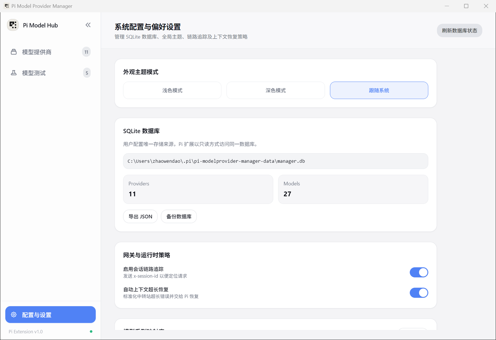

# 系统偏好与数据运维

管理面板的所有配置、测试数据与使用记录都妥善保存在你的本地，无需任何外部云端依赖。

---

## 设置面板总览

点击侧边栏底部的 **「配置与设置」**：

面板分为四个主要区域：
1. **外观主题**：支持浅色模式、深色模式或跟随系统。
2. **SQLite 数据库管理**：查看当前数据规模、一键备份与 JSON 导出。
3. **网关与运行时策略**：链路追踪与超长恢复开关。
4. **模型系列映射库**：管理各品牌模型的分组与图标识别规则。

---

## 为什么用 SQLite 替代旧的 config.yaml？

许多同类工具习惯把配置存在 YAML 或 JSON 文件里，但这有几个致命缺陷：
- **缩进极易损坏**：手改时不小心多打了一个空格，整个配置文件就解析失败，甚至导致插件无法启动。
- **并发冲突与文件损坏**：如果桌面端正在写配置，终端刚好在读，极易出现写入撕裂或内容被清空。

我们**彻底淘汰了 YAML 文件**，统一采用 **SQLite 数据库 (`manager.db`)** 作为唯一存储：
- **存储路径**：`~/.pi/pi-modelprovider-manager-data/manager.db`。
- **安全并发**：Pi 终端以纯只读模式（`mode=ro`）连接数据库，桌面端在事务保护下执行写入，彻底避免读写冲突。
- **数据稳固**：任何增删改操作都由 SQLite 事务保证，中途断电也不会丢失历史数据。

---

## 环境隔离：开发测试不影响日常工作

为了确保你在调试、测试或开发新功能时，不会搞乱日常真正写代码用的模型配置，系统对数据进行了物理隔离：

| 环境 | 数据目录 | 说明 |
| :--- | :--- | :--- |
| **生产环境（日常使用）** | `~/.pi/pi-modelprovider-manager-data/` | 默认环境。平时写代码、调用模型的真实配置。 |
| **开发环境（源码调试）** | `~/.pi/pi-modelprovider-manager-data/dev-cache/` | 运行 `pnpm dev` 或设置了 `PI_MODEL_MANAGER_ENV=development` 时自动生效。拥有独立的数据库与沙箱，互不干扰。 |

---

## 备份与导出

- **导出 JSON**：点击「导出 JSON」，系统会将当前所有提供商、模型配置和补丁规则打包输出为一份标准 JSON 文件。适合把一套调校好的渠道配置分发给团队成员或在新电脑上导入。
- **备份数据库**：点击「备份数据库」，系统会自动为当前的 `manager.db` 创建带时间戳的安全快照文件，方便随时回滚。

---

## 模型系列映射库在线更新

为了让列表和选择器能正确显示各个大模型品牌的专属图标与分类，系统内置了包含 932+ 款模型的系列识别库（感谢开源项目 Cherry Studio 的基础数据）。

当有新的模型系列（如 Claude 3.8 或 DeepSeek 新分支）发布时，点击面板上的 **「检查更新」**，即可直接在线同步最新的识别规则，无需升级软件本身。
